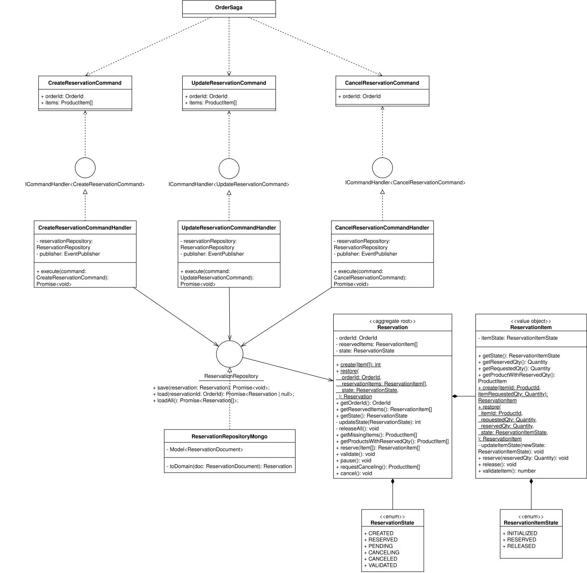
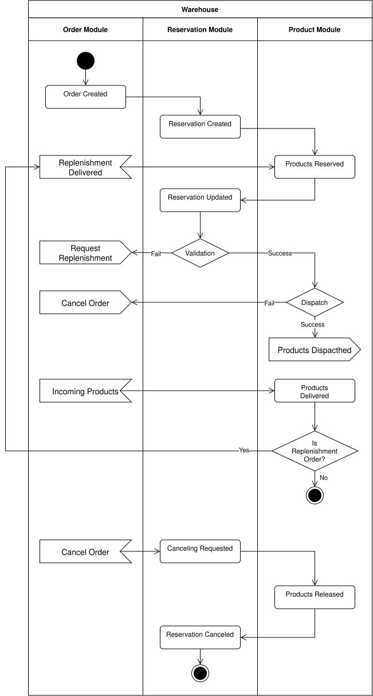
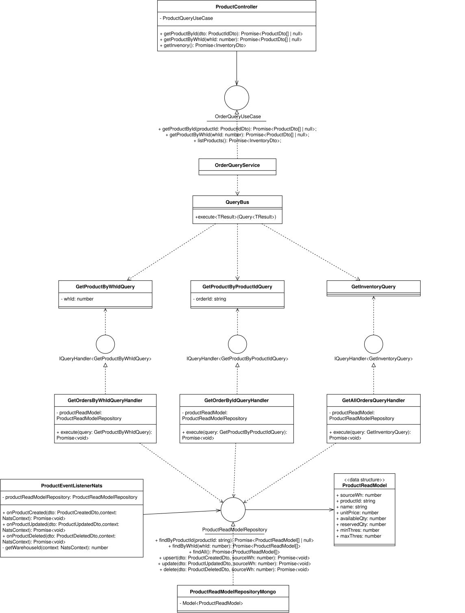
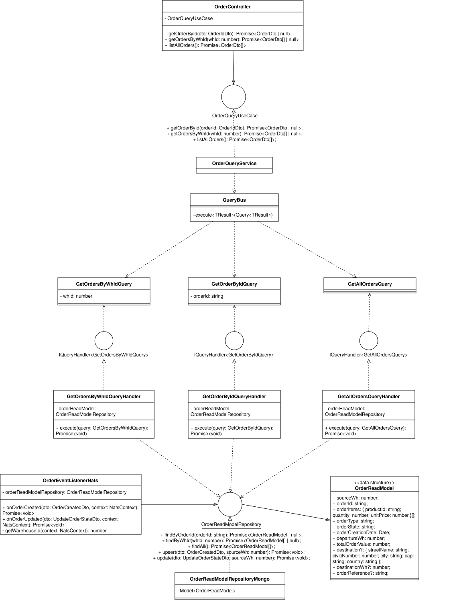

# MVP – Sistema di Gestione di un Magazzino Distribuito

[](https://github.com/ssperanz/mvp/actions/workflows/ci.yml)
[](https://codecov.io/gh/ssperanz/mvp)

## Informativa

Questa è una fork indipendente del progetto iniziale, della quale sono stati riprogettati, riscritti e ritestati alcuni microservizi, tra cui il servizio di magazzino e quello di aggregazione dei dati dei magazzini.

I diagrammi delle classi dei nuovi microservizi warehouse e warehouse-aggregator sono visibili nella cartella docs del progetto.
Nella stessa cartella è disponibile una relazione dettagliata delle modifiche apportate al progetto originale.

---

## Descrizione

Questo progetto rappresenta un **MVP (Minimum Viable Product)** per la gestione di un sistema di magazzini distribuiti, pensato per supportare scenari di logistica avanzata, orchestrazione di ordini, gestione delle scorte e monitoraggio centralizzato tramite microservizi.

L’architettura si basa su **microservizi** sviluppati con [NestJS](https://nestjs.com/), con comunicazione tramite API REST e messaggistica, e include strumenti di monitoraggio come **Prometheus** e **Grafana**.

---

## Struttura del Progetto

```
microservices/
│
├── centralized/           # Servizi centrali (autenticazione, sistema centrale, routing, aggregazione stato)
│
├── warehouse-aggregated/  # Microservizio aggregazione warehouse (ordini, inventario)
│
├── warehouse/             # Microservizio warehouse (ordini, inventario, stato)
│
├── grafana/               # Dashboard di monitoraggio
│
└── prometheus/            # Configurazione Prometheus
```

### Microservizi Principali

- **Warehouse**
  - `warehouse`: Gestione prodotti, ordini e stato del singolo magazzino

- **Cloud**
  - `warehouse-aggregated`: Aggregazione e sincronizzazione ordini e inventario

- **Centralized**
  - `authentication`: Gestione autenticazione e autorizzazione utenti
  - `CentralSystem`: Coordinamento centrale e orchestrazione
  - `routing`: Gestione del routing degli ordini e delle spedizioni
  - `state_aggregate`: Aggregazione e monitoraggio dello stato globale

- **Monitoring**
  - `grafana`: Dashboard per visualizzazione metriche
  - `prometheus`: Raccolta e scraping metriche

---

## Come Avviare il Progetto

> **Prerequisiti:**  
> - [Docker](https://www.docker.com/) (per database, microservizi e monitoring)

### 1. Clona il repository

```bash
git clone https://github.com/teamcodealchemists/MVP.git
cd MVP/microservices
```

### 2. Avvia tutti i servizi con Docker Compose

```bash
docker-compose up --build
```

Tutti i microservizi, database e strumenti di monitoring verranno avviati automaticamente.

---

## Architettura

In seguito sono illustrati i principali diagrammi UML dei nuovi microservizi warehouse e warehouse-aggregator.

### Warehouse
<details>
<summary>Product</summary>

</details>
<details>
<summary>Order</summary>

</details>
<details>
<summary>Reservation</summary>

</details>
<details>
<summary>Order Saga</summary>

</details>

### Warehouse Aggregator
<details>
<summary>Product</summary>

</details>
<details>
<summary>Order</summary>

</details>

---

## Testing

Per eseguire i test di un microservizio, posizionati nella sua cartella e lancia:

```bash
npm run test
```

Per i test di integrazione e di sistema è necessario prima avviare il docker-compose di test dalla root del progetto:

```bash
docker compose -f docker-compose.test.yaml up
```

Per i test di sistema, posizionarsi nella cartella /microservices/test/system prima di lanciare il comando di test.

I test sono stati automatizzati nella pipeline di Continuos Integration di Github Actions.

La copertura del codice è monitorata tramite Codecov.

### Test Coverage

| Servizio | Coverage |
|---|---|
| Warehouse | [](https://codecov.io/gh/ssperanz/mvp/flags/warehouse) |
| Warehouse Aggregator | [](https://codecov.io/gh/ssperanz/mvp/flags/warehouse-aggregator) |
| Central System | [](https://codecov.io/gh/ssperanz/mvp/flags/centralSystem) |
| Authentication | [](https://codecov.io/gh/ssperanz/mvp/flags/auth) |
| Routing | [](https://codecov.io/gh/ssperanz/mvp/flags/routing) |
| State Aggregate | [](https://codecov.io/gh/ssperanz/mvp/flags/CloudState) |

---

## Dashboard & Monitoring

- **Prometheus**: [localhost:9090](http://localhost:9090)
- **Grafana**: [localhost:3210](http://localhost:3210)  
  (login di default: `admin` / `admin`)

---

## Documentazione
- [Relazione](docs/Relazione.md)
- [Diagrammi UML](docs/diagrams)

---

## Autori

- Team Code Alchemists (progetto originale)
[https://github.com/teamcodealchemists](https://github.com/teamcodealchemists)
- Stefano Speranza (fork)
[https://github.com/ssperanz](https://github.com/ssperanz)